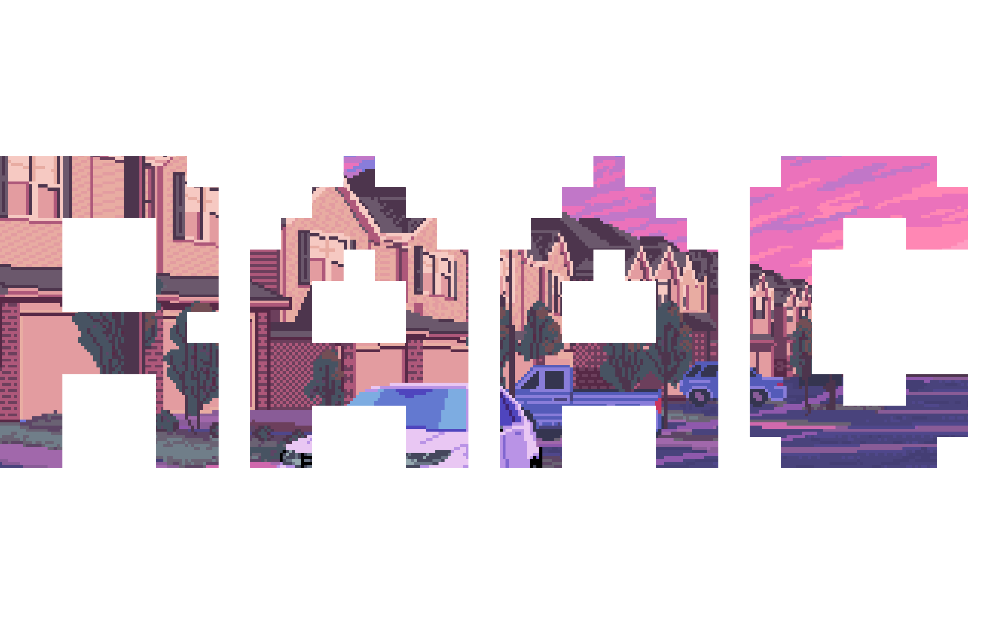

# RAAC Developer Documentation

| Tool | Description |
|------|------------|
| [Deployer](https://github.com/RegnumAurumAcquisitionCorp/core/tree/main/library/Deployer) | Contract deployment and management tool with UI/CLI interfaces |
| [RPC Library](https://github.com/RegnumAurumAcquisitionCorp/rpc) | Interface for interacting with RAAC smart contracts |
| [Core Contracts](https://github.com/RegnumAurumAcquisitionCorp/core) | Main protocol smart contracts (tokens, pools, governance) |

| Type | Link |
|------|------|
| Twitter |  |
| Documentation |  |
| Website |  |
| GitHub |  |

